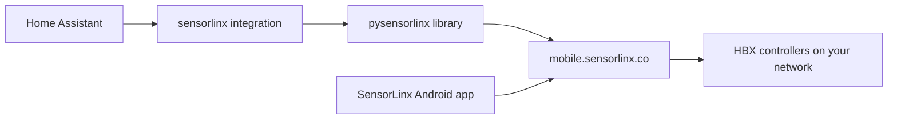

# HBX SensorLinx for Home Assistant

Bring your **HBX floor heating / hydronic system** (SensorLinx app) into Home Assistant.

This project wraps the unofficial [pysensorlinx](https://github.com/sslivins/pysensorlinx) Python library, which talks to the same cloud API the Android app uses at `https://mobile.sensorlinx.co`.

## Supported hardware

| Device | HA entities |
|--------|-------------|
| **THM-0600** thermostat | Climate, room/floor temp, humidity, away switch, heat/cool demand |
| **ZON-0600** zone controller | Zone relays (1–16), pump status, system demands, app button, aux setpoint |
| **ECO-0600** heat pump / boiler | Outdoor temperature sensor, system state |

### THM-0600 + ZON-0600 floor heating

This is the typical radiant floor setup:

- **THM-0600** — wall thermostat with room + **floor** temperature sensors
- **ZON-0600** — drives up to 16 heating zones and circulation pumps

In Home Assistant, THM thermostats appear **under their ZON controller** in the device tree when linked in the SensorLinx app.

## Quick start on Home Assistant OS

### 1. Copy the integration

Copy the `custom_components/sensorlinx` folder into your Home Assistant `config` directory:

```
config/
  custom_components/
    sensorlinx/
      __init__.py
      manifest.json
      ...
```

Ways to do this:

- **Samba / File Editor**: paste the folder under `/config/custom_components/`
- **SSH add-on**: `scp -r custom_components/sensorlinx root@homeassistant.local:/config/custom_components/`

### 2. Restart Home Assistant

Settings → System → Restart

### 3. Add the integration

Settings → Devices & services → Add integration → search **HBX SensorLinx**

Use the same email and password as the SensorLinx Android app.

### 4. Link physical hot-water and floor switches (optional)

If your installation uses **smart plugs or switches** to power the hot-water heater and radiant-floor controller (separate from the HBX cloud devices), link them so SensorLinx stays in sync when you flip those switches.

After the integration is installed:

1. **Settings → Devices & services → HBX SensorLinx → Configure**
2. Set the entity IDs for your physical switches:

| Option | Forest Home example | Role |
|--------|---------------------|------|
| **Hot water heater switch** | `switch.hot_water_heater` | Powers the tankless / hot-water source for the floor loop |
| **Radiant floor controller switch** | `switch.radiant_floor_contoller` | Powers the HBX zone controller and circulation pumps |
| **Heated floor controller** | `light.smart_switch_single_pole_3_way` | Optional second master switch (some installs use a smart-switch *light* entity) |

**When a linked switch turns OFF**, the integration:

- **Hot water** — disables DHW on ZON/ECO devices (when exposed) and enables **Away mode** on all THM thermostats
- **Radiant floor** — sets all THMs to **Off** + **Away**, and clears the ZON **App button** if it was on

**When the switch turns back ON**, the previous SensorLinx settings are restored from a snapshot taken at shutdown.

Leave an option blank if you do not use that physical switch.

### 5. Verify devices

Run the discovery script locally first (optional):

```powershell
$env:SENSORLINX_EMAIL = "you@example.com"
$env:SENSORLINX_PASSWORD = "your-password"
pip install pysensorlinx
python scripts/discover_devices.py
```

## What you get in Home Assistant

### Per THM-0600 thermostat

- **Climate** — set heat/cool/auto/off and target temperature
- **Sensors** — room temperature, **floor temperature**, humidity
- **Switch** — away mode
- **Binary sensors** — heating demand, cooling demand

### Per ZON-0600 zone controller

- **Binary sensors** — each heating zone relay (Zone 1–16), pump run state, system demands
- **Sensor** — count of active zones
- **Switch** — app button (manual override relay)
- **Number** — auxiliary heat setpoint

## Do I need to capture app traffic?

**Usually no.** The SensorLinx cloud API is already mapped by `pysensorlinx`. Traffic capture is only needed if you have an unsupported controller or want to extend the integration.

See [docs/capture-traffic.md](docs/capture-traffic.md) for mitmproxy / HTTP Toolkit instructions.

## Architecture



The app and Home Assistant both talk to HBX's cloud — your controllers stay on your Wi-Fi and phone the cloud with status updates.

## External switch behavior

The HBX cloud API does not expose a single “system master off” for ZON-0600 controllers. Whole-system shutdown is achieved by combining:

| API surface | Device | Effect |
|-------------|--------|--------|
| `set_dhw_enabled(False)` | ZON / ECO | Stops domestic hot-water demand |
| `set_away_mode(True)` | THM-0600 | Suppresses thermostat heat calls |
| `set_hvac_mode("off")` | THM-0600 | Turns off changeover / floor demand |
| `set_app_button(False)` | ZON-0600 | Clears manual override relay 12 |

Pump and zone relays follow THM demand — when thermostats are off/away and DHW is disabled, circulation pumps stop.

## Automation examples

```yaml
# Turn on away mode when nobody is home
automation:
  - alias: Floor heat away mode
    trigger:
      - platform: state
        entity_id: zone.home
        to: not_home
    action:
      - service: switch.turn_on
        target:
          entity_id: switch.living_room_away_mode

# Alert if floor temp drops while heating is demanded
automation:
  - alias: Floor not warming
    trigger:
      - platform: template
        value_template: >
          {{ is_state('binary_sensor.living_room_heating_demand', 'on')
             and states('sensor.living_room_floor_temperature')|float(999) < 65 }}
    action:
      - service: notify.mobile_app_your_phone
        data:
          message: "Living room floor is not warming up"

# Notify when a ZON zone turns on
automation:
  - alias: Floor zone activated
    trigger:
      - platform: state
        entity_id: binary_sensor.my_zon_zone_3
        to: "on"
    action:
      - service: notify.mobile_app_your_phone
        data:
          message: "Zone 3 floor heating is now active"
```

## HACS install (recommended)

1. HACS → Integrations → ⋮ → Custom repositories
2. Add `https://github.com/redawg/hass-sensorlinx` as category **Integration**
3. Search **HBX SensorLinx** → Download
4. Restart Home Assistant → Add integration

## Credits

- API reverse engineering: [sslivins/pysensorlinx](https://github.com/sslivins/pysensorlinx)
- HBX product docs: [hbxcontrols.com](https://www.hbxcontrols.com/)

## License

MIT
